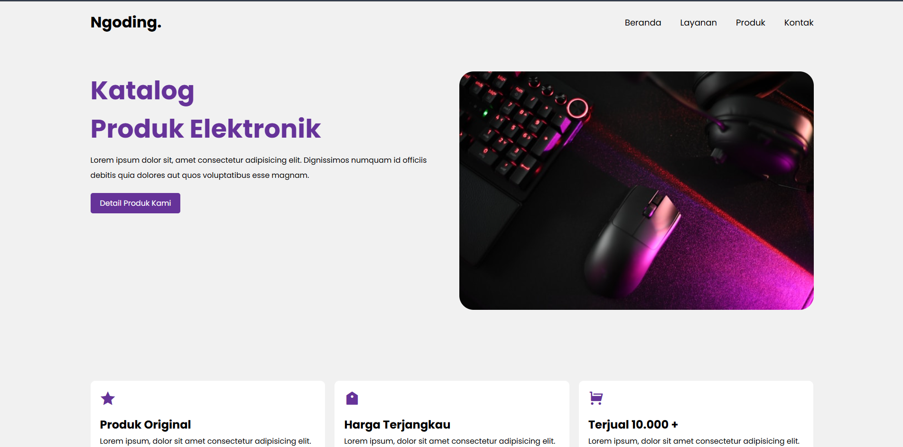

# 🛍️ Web Product Catalog

A simple responsive product catalog website built using **HTML, CSS (Vanilla), and JavaScript**.  
This project was developed as part of my frontend learning journey and serves as a portfolio project for internship applications.

---

## 📌 Project Overview

The Web Product Catalog displays a structured list of products with a clean and user-friendly interface.  
It focuses on implementing fundamental frontend concepts without using any external CSS or JavaScript frameworks.

---

## 🚀 Features

- Structured product display layout
- Responsive design (mobile-friendly)
- DOM manipulation using JavaScript
- Clean and simple user interface
- Organized project folder structure

---

## 🛠 Tech Stack

- **HTML5** (Semantic Markup)
- **CSS3 (Vanilla CSS)** – Flexbox & Responsive Design
- **JavaScript (Basic)** – DOM Manipulation & Event Handling

---

## 💻 Development Tools

- Visual Studio Code
- Google Chrome DevTools
- Git & GitHub

---

## 📷 Preview

---

## 🔗 Live Demo

https://indradityaa.github.io/KATALOG-PRODUCTS/

---

## 📂 Repository Structure

├── assets/
│ ├── icons/
│ └── images/
│
├── dist/
│ ├── css/
│ │ └── style.css
│ └── js/
│ └── script.js
│
├── index.html
├── detail.html
├── .gitignore
└── README.md

---

## 🎯 Learning Objectives

- Practice responsive layout using pure CSS
- Improve understanding of DOM manipulation
- Strengthen fundamental frontend development skills
- Build a clean and structured web project

---

## 📈 Future Improvements

- Add product filtering functionality
- Implement search feature
- Connect to backend/database
- Improve UI design and animations
